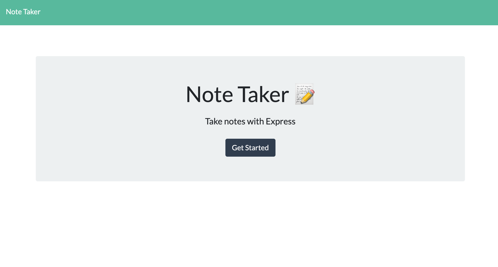
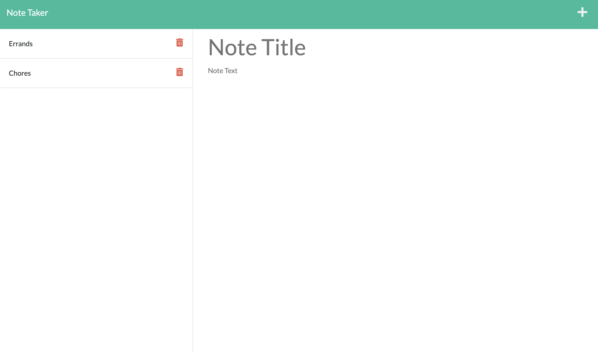

# Note Taker
 
[](https://opensource.org/licenses/MIT)

## Description
This application is a note taker that allows the user to write and track various notes throughout their day or week. This application uses Node.js, UUID, Bootstrap, Font Awesome, and an Express.js back-end to save and retrieve note data from a JSON file.

## Table of Contents
- [Installation](#installation)
- [Usage](#usage)
- [Credits](#credits)
- [License](#license)
- [Contributing](#contributing)
- [Tests](#tests)
- [Questions](#questions)

## Installation
To install the application locally, ensure that [Node.js](https://nodejs.org/en/download/) is installed, then clone the repository from Github and run the installation script ```npm install``` followed by the start script ```npm start```, and open http://localhost:3001 in any browser.

## Usage
To use the application, click the "Get Started" button. Then enter a note title and text for the note. To save, click the save button in the top right corner. The user's note will display on the left sidebar. To view the note text, click on the note title. To delete a note, click on the trash can on the right side of the note title



## Credits
Collaborators: <br>
Amaryah Wolf <br>
Starter code provided by UCLA Extension Boot Camps

## License
This application is covered under the MIT license.

## Contributing
[Contributor Covenant](https://www.contributor-covenant.org/version/2/1/code_of_conduct/)

## Tests
N/A

## Questions
For additional questions, find me on [github](https://github.com/amaryahwolf) or email me at amaryahwolf@gmail.com.
